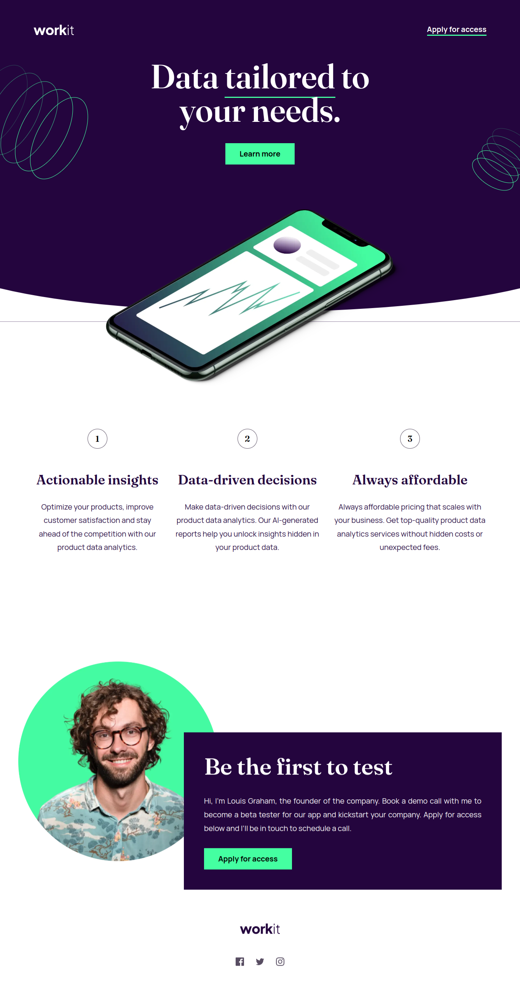

# Frontend Mentor - Password generator app

This is a solution to the [Password Generator App](https://www.frontendmentor.io/challenges/password-generator-app-Mr8CLycqjh). Frontend Mentor challenges help you improve your coding skills by building realistic projects. 

## Welcome! 👋

Thanks for purchasing this premium Frontend Mentor coding challenge.

[Frontend Mentor](https://www.frontendmentor.io) challenges help you improve your coding skills by building realistic projects. These premium challenges are perfect portfolio pieces, so please feel free to use what you create in your portfolio to show others.

**To do this challenge, you need a strong understanding of HTML, CSS, and JavaScript.**

## Table of contents

- [Overview](#overview)
  - [The challenge](#the-challenge)
  - [Screenshot](#screenshot)
  - [Links](#links)
- [My process](#my-process)
  - [What I learn](#what-i-learn)
  - [Built with](#built-with)
  - [Useful resources](#useful-resources)
- [Author](#author)
- [Acknowledgments](#acknowledgments)

## Overview

### The challenge

Your challenge is to build out this password generator app and get it looking as close to the design as possible.

You can use any tools you like to help you complete the challenge. So if you've got something you'd like to practice, feel free to give it a go.

Your users should be able to:

- Generate a password based on the selected inclusion options
- Copy the generated password to the computer's clipboard
- See a strength rating for their generated password
- View the optimal layout for the interface depending on their device's screen size
- See hover and focus states for all interactive elements on the page

### Screenshot

### Links

- Solution URL: [GitHub repository](https://github.com/welpmoz/password-generator-app).
- Live Site URL: [Live site](https://welpmoz.github.io/password-generator-app/)

## My process

### What I learn

- Save some text in the clipboard.
- Use ChatGPT for save time markuping with meaningful class names
- Use ChatGPT for remember some css properties
- I use [zxcvbn](https://www.npmjs.com/package/zxcvbn) library for estimate the strength password

### Built with

- Semantic HTML5 markup
- Vanilla Javascript
- CSS variables
- BEM methodology
- Google Fonts
- Git & GitHub
- Mobile first approach

### Useful resources

- [Responsively](https://responsively.app/): A best browser for develop responsive webs.
- [Google Fonts](https://fonts.google.com/): Provide beatiful fonts to integrate in your web sites.
- [CSS examples](https://github.com/lsvekis/HTML-CSS-Exercises-Book): Simple but powerful examples that improve my CSS skills.
- [w3schools](https://www.w3schools.com): Great resource that provide several examples of HTML, CSS & JavaScript.
- [animation rocks](https://cssanimation.rocks/): Provide several innovative ideas for animate your project.

## Author

- Github - [Roswell Jaime](https://github.com/welpmoz)
- Frontend Mentor - [@welpmoz](https://www.frontendmentor.io/profile/welpmoz)

## Acknowledgments

I greatly appreciate the work done by the Frontend Mentor team. Their challenges are diverse and well-suited for developers at all levels. Additionally, I'm grateful for the inclusion of Figma as a useful resource.